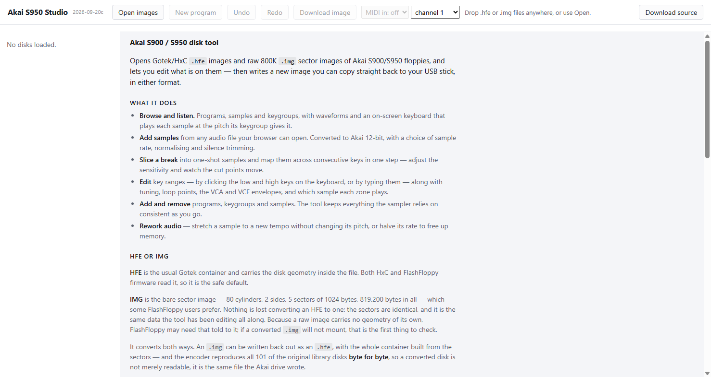
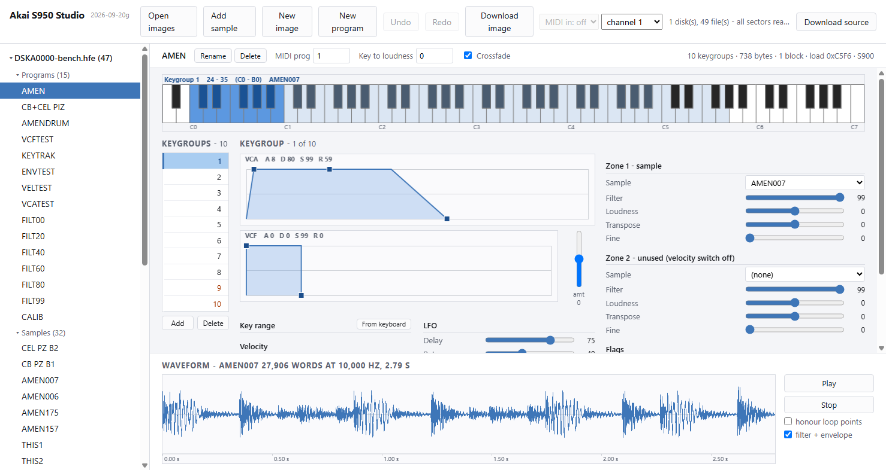
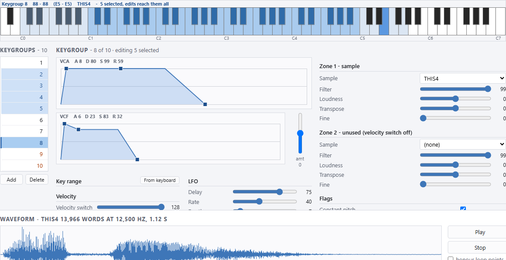
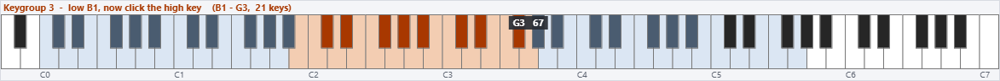
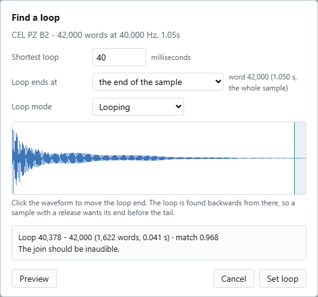
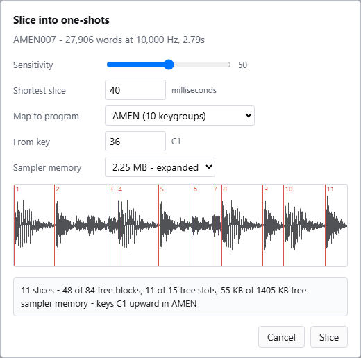

# A walk through Akai S950 Studio

This is the tour: open a disk, listen to what is on it, change something, and write a new
image you can put on a Gotek. It assumes nothing about the S950 beyond having one, or
wanting to make disks for one.

Nothing is uploaded anywhere. Every image you open is read and written inside the page, on
your own machine, and the file you opened is never modified — the tool writes a new one.

**Back up your images first.** This tool writes a new image rather than altering the
original, but the copy you put on your Gotek replaces what was there, and a backup is the
only thing that makes a mistake undoable.

---

## 1. Open it

Open `index.html`. That is the whole installation — plain HTML and JavaScript, no build
step, no dependencies, and it works straight from a `file://` page.



Two things a local file cannot have, because browsers only grant them over http or https:
**Web MIDI**, so the MIDI control stays greyed out, and `fetch`, which the self-test needs.
If you want either, serve the folder — `node serve.js`, `python -m http.server 8000` or
`npx serve` all do — and open the address it prints.

## 2. Drop a disk on it

Drop one or more `.hfe` or `.img` files anywhere on the window, or use **Open images**. A
Gotek/HxC `.hfe` and a raw 800K `.img` are both read, and either can be written back out.

Or start with nothing: **New image** makes an empty 800K disk in the page, ready to fill.
It exists only in the browser until you download it, so it is marked unsaved from the
moment it appears.

The tree on the left fills with what is on the disk, grouped by type: programs, samples,
drum sets and the overall settings. The status line says whether every sector read cleanly
— worth a glance, because a disk with bad sectors is telling you something.

## 3. Look at a program

Click one, and the pane fills in.



Reading it from the top:

- **The info strip** under the toolbar: the program's name, its own editable fields — MIDI
  program, key to loudness, crossfade — and then the facts. A program says everything it
  has to say in one line.
- **The keyboard.** Every keygroup's range is washed pale; the selected one is solid. The
  caption names it and the sample it plays. Click a key to hear that keygroup's sample *at
  that key's pitch*, using the same varispeed the sampler uses.
- **The velocity strip**, on the right of the keyboard, setting how hard that click
  strikes. Velocity opens the filter — a little over an octave between a middling strike
  and a hard one — so a program can sound as though it has no filter at all when every key
  is being hit at full force. Drag it down and the same note closes right up.
- **The keygroup numbers**, down the left. That is all they carry, because everything else
  about a keygroup is in the editor beside them. Hovering a number names its key range and
  sample, and a keygroup whose sample is not on this disk is marked.
- **The editor**: both envelopes, then the key range and velocity, the LFO, and the two
  zones with their samples and tuning.
- **The waveform**, docked along the bottom with its transport beside it, showing the
  sample the selected keygroup plays, with the start, loop and end markers drawn.

## 4. Change something

Drag an envelope corner, or move a slider. Every parameter is a slider because these are
things you sweep by ear rather than numbers you arrive knowing: it writes as it moves, the
whole drag counts as one undo, and **Undo** and **Redo** work throughout.

Edits are held in the page. The disk in the tree gets a `*` while it has unsaved changes.

### Several keygroups at once

Ctrl-click adds a keygroup to the selection, shift-click takes the run. The editor shows
the one you clicked last, and every control then writes to all of them.



The header says what is about to happen — *8 of 10 · editing 5 selected* — and so does the
keyboard caption. It is one undo however many it touches. That is how one filter setting
goes across a whole drum kit without typing it eight times.

### A key range, by pointing at it

Two boxes wanting MIDI numbers are a poor way to say something the keyboard says better.
Press **From keyboard**, beside the Key range heading, and click the low key and then the
high one.



The keys shade as you move between them and the caption names the range. The same key twice
gives a one-key group, the two clicks work in either order, and Esc cancels. With several
keygroups selected it sets all of them.

## 5. Find a loop

Select a sample and press **Find loop**.



The S950 holds a loop as an **end point and a length**, and plays `end - length .. end`
round and round. So the only thing to find is how far back the loop restarts, and the tool
looks for the point whose approach matches the approach to the end — that being the join
your ear actually hears.

It reports a **match** between −1 and 1 and says what to expect of it: inaudible above 0.95,
audible below about 0.8, and hopeless on material with no repeating part in it. Applause and
running water have no clean loop, and the number says so rather than pretending.

**The loop end is a choice, and it matters.** A sample meant to be held has a tail after its
loop — the release you hear when the key comes up. Loop to the end of the sample and that
release plays round and round, with none of it left to hear. So the end is offered three
ways, and the waveform is clickable: put the end where you want it, and the loop is found
backwards from there.

**Preview** auditions it before anything is written.

## 6. Slice a break

Select a break and press **Slice**.



It finds the hits, cuts the sample at them, and can map the pieces to consecutive keys of a
program in the same step. Drag **Sensitivity** and watch the cut points move. The summary
line is the important part: it costs directory slots, disk blocks *and* sampler memory, and
it tells you what each will cost before you commit — the sampler's memory being the one
thing the disk cannot tell you about, so say which machine you have.

### Trimming the silence off

**Trim silence** removes it from both ends and moves the markers with the audio. Silence is
anything below about −48 dB, so a tail that fades into noise is kept — that is audio, not
silence.

If the sample loops, the cut stops at the loop end rather than reaching into the loop, and
the confirmation tells you when that happened.

There is no way to select a region of the waveform and delete it — the trim is the whole of
it. If you need to cut something out of the middle, that is not here yet.

## 7. Add your own sample

**Add sample** reads any audio file your browser can decode — WAV, MP3, FLAC, AAC, Ogg — and
converts it to the S950's 12-bit format. You choose the sample rate, the nominal pitch, the
loop mode, whether to normalise, and how much of the file to use. It refuses outright if the
result will not fit in the free blocks, and says by how much.

## 7a. Move things between disks

Open a second image and the file row grows a **Copy to** picker: it puts the selected
sample or program onto any other disk that is open. A program never travels alone — every
sample its zones name comes with it, or it would arrive silent — so a confirmation
itemises the whole set and what it costs in blocks first.

Nothing on the receiving disk is replaced. A name already taken by a *different* file is
renamed, and the copied program's zones follow it to the new name; a name taken by the
*same* file is skipped, so copying twice costs nothing the second time.

**Copy to...** under the keygroup list moves a single keygroup onto another program. That
one may land on a program on the same disk, which a whole-file copy will not do, and it
brings only the samples its own zones name.

## 7b. Take a sample out as a WAV

**Export WAV** saves the selected sample as an ordinary 16-bit WAV at its own rate, for a
DAW or another sampler. The whole sample comes out untrimmed, and the loop is not baked
into the audio: it travels in the file's `smpl` chunk along with the root note, so a
sampler that reads that chunk picks the loop up by itself and one that does not still gets
the whole sound.

## 8. Write the disk back

Press **Download image**, choose a name and a container, and copy the file to your Gotek.

- **HFE** is the usual Gotek container and carries the disk geometry inside the file. Both
  HxC and FlashFloppy read it, so it is the safe default. When the disk was opened from an
  HFE, its sectors are patched in place, so the bitstream around them is left exactly as it
  was.
- **IMG** is the bare sector image — 80 cylinders, 2 sides, 5 sectors of 1024 bytes,
  819,200 bytes. Some FlashFloppy users prefer it. Nothing is lost converting between them.

Converting an `.img` to `.hfe` builds the whole container from the sectors, and that encoder
reproduces all 101 of the original library disks **byte for byte** — a converted disk is not
merely readable, it is the same file the Akai drive wrote.

## 9. Playing it from a MIDI source

Pick a MIDI input in the toolbar, select a program, and play. Eight voices, with the
keygroup under each note deciding the sample, the tuning and the whole voice — filter,
envelopes and vibrato included. Useful for hearing a program as an instrument rather than
as a list, and for sending the same part here and to a real S950 to compare the two.

**Your modwheel works.** The S950 adds vibrato in proportion to it, scaled by a per-keygroup
setting that 427 of the library’s 1908 keygroups change, so a program that seems to have no
LFO may simply be waiting for the wheel.

The vibrato is measured rather than invented: a sine, a rate that runs from 1.8 Hz to 10.6
and is linear in the stored setting, a depth of about 1.5 cents a unit, and a delay that
fades the wobble in rather than waiting and then starting it. The **LFO** box beside the
filter one turns it off. How all that was measured is in the README, under *Calibrating the
LFO*.

MIDI is granted per-site and only over http or https, so serve the page (see step 1) and
allow the permission when the browser asks.

---

## If something looks wrong

The build stamp next to the title says which version of the code is running. If it is not
the one you expect, you are on a cached page: Ctrl+Shift+R.

`test/selftest.html` drives the whole interface end to end in your browser and says what passed.
It needs a disk to work on, named in the query string:

```
http://localhost:8080/test/selftest.html?disk=your-disk.hfe
```

The Node scripts in the repository check the disk format itself against a library of real
disks — `test/fsck.js` for a single image, and the rest for the operations that resize or reorder
files. `README.md` lists them.

And if you want to know what any of it means on the disk itself,
[S950-Disk-Format.pdf](S950-Disk-Format.pdf) is the format written up: the container, the
MFM encoding, the directory and allocation table, the sample and program records, and the
arena they share.

## The honest disclaimer

This is an independent tool with no connection to Akai, offered as-is and with no warranty.
It talks to disk images on your computer, never to your sampler, so it cannot reach your
hardware directly.

What it *can* do is write an image your sampler does not like. The disk format was worked out
by reading a library of 101 original disks and confirmed on a real S950, and every image this
tool produces is checked against the structures the sampler depends on — but a malformed
image can make an S950 hang while loading. That is recoverable with a power cycle and a good
disk, and no fun in the middle of a session. Try an edited disk before you rely on it, and
keep that backup.
